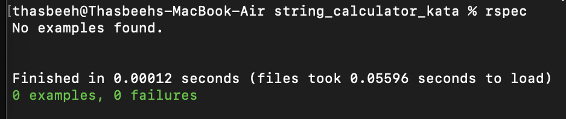
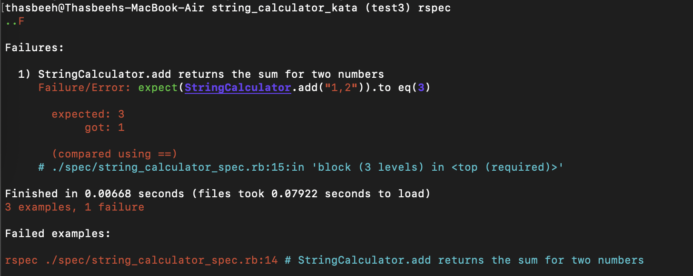
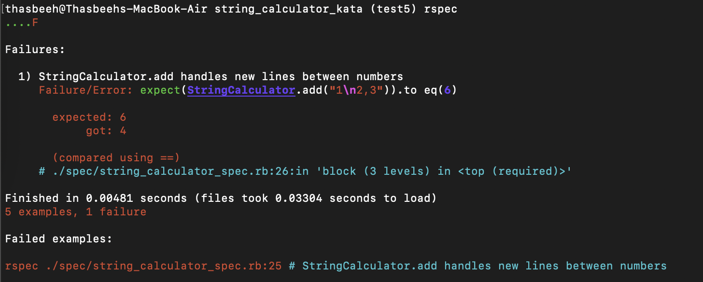

# String Calculator TDD Kata

Initial commit before any test case

Test1 - add failing spec for empty string

Test2 - add failing spec for single number string

Test3 - add failing spec for sums of two numbers

Test4 - test for sums of n numbers is already passed by the feature to sum two numbers

Test 5 - add failing spec for new line between numbers

