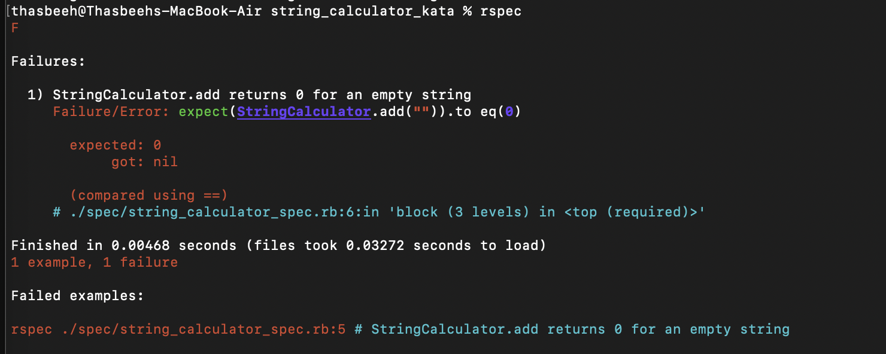
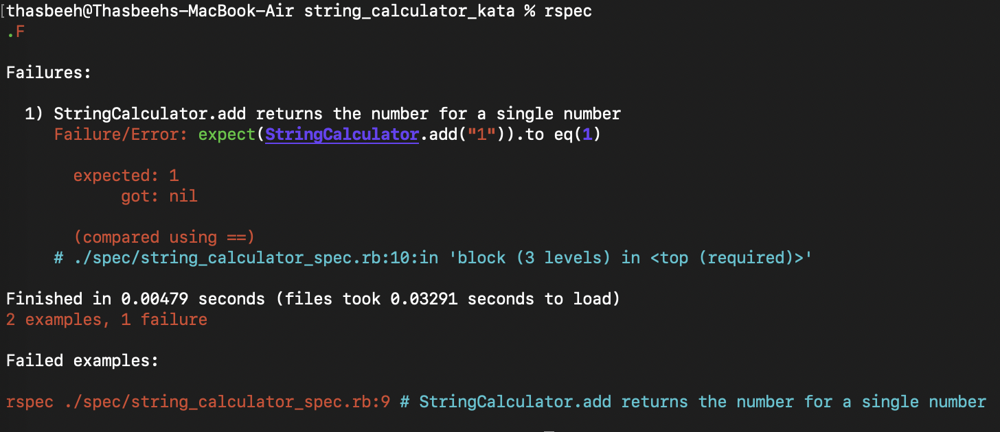

# String Calculator TDD Kata
This project implements the **String Calculator Kata** using **Test-Driven Development (TDD)** in Ruby. Each step introduces a failing test first, followed by the minimal implementation needed to make it pass. Screenshots of failing test runs are included to document the process.  

---

## 🛠 Tech Stack
- Ruby
- RSpec (for testing)
- Git (incremental commits showing TDD workflow)

---

## ✅ Progress by TDD Steps

### Step 0 – Initial Commit
Initial project setup, before any test case.


---

### Step 1 – Empty String
- **Test:** Adding an empty string should return `0`.


### Step 2 – Single Number
- **Test:** Adding a string with a single number returns that number.


### Step 3 – Two Numbers
- **Test:** Adding two comma-separated numbers returns their sum.


### Step 4 – n Numbers
- **Test:** Adding more than two numbers should return their sum.
- ✅ Already passed with the feature from step 3 (no extra code needed).

### Step 5 – Newlines Between Numbers
- **Test:** Allow \n as a delimiter along with commas.


### Step 6 – Custom Delimiters
- **Test:** Support custom delimiters defined in a header.


### Step 7 – Negative Numbers
- **Test:** Raise an exception when negatives are present, showing all negatives in the error message.


### Step 8 – Delimiters of Any Length
- **Test:** Support multi-character delimiters.


### All tests passed till Step 8


## 🔮 Future Enhancements
- Step 9: Support multiple delimiters (`//[*][%]\n1*2%3`)
- Step 10: Support multiple delimiters of any length (`//[***][%%]\n1***2%%3`)

---

## ▶️ How to Run

```bash
# Clone the repository
git clone https://github.com/Thasbeeh/string_calculator_kata.git

# Move into project folder
cd string_calculator_kata

# Install dependencies
bundle install

# Run tests
rspec
```

---

## 🎯 Key Learnings
- Practicing the **Red → Green → Refactor** cycle.
- Keeping commits small, clear, and incremental (`test: ...`, `feat: ...`, `refactor: ...`)
- Handling edge cases (empty input, negatives, variable delimiters).
